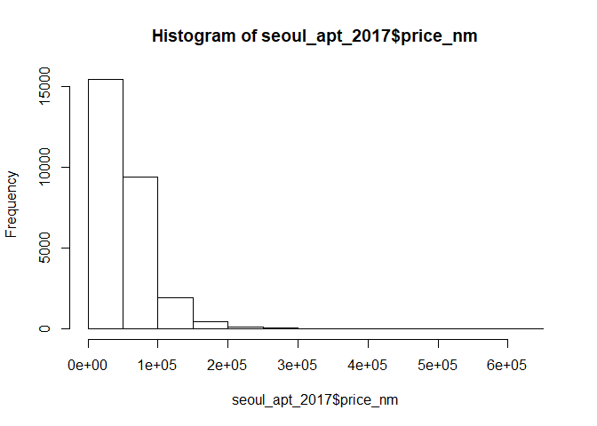

OpenAPI
================

``` r
#getwd()
api_url <- "http://openapi.molit.go.kr/OpenAPI_ToolInstallPackage/service/rest/RTMSOBJSvc/getRTMSDataSvcAptTradeDev?LAWD_CD="
service_key <- "N5wsj39GDaAiQLtjarV3fxP4cIotnL95k5qplhB8D3v4lFZTsK421dgVGVRg9vhb7wjD92aseJYFHDvNZk45Yg%3D%3D"

locCode <-c("11110","11140","11170","11200","11215","11230","11260","11290","11305","11320",
            "11350","11380","11410","11440","11470","11500","11530","11545","11560","11590",
            "11620","11650","11680","11710","11740")

locCode_nm <-c("종로구","중구","용산구","성동구","광진구","동대문구","중랑구","성북구","강북구","도봉구",
               "노원구","은평구","서대문구","마포구","양천구","강서구","구로구","금천구","영등포구","동작구",
               "관악구","서초구","강남구","송파구","강동구")

datelist <-c("201701","201702","201703","201704")

urllist <- list()
cnt <-0
for(i in 1:length(locCode)){
 for(j in 1:length(datelist)){
    cnt = cnt + 1
    urllist[cnt] <- paste0(api_url,locCode[i],"&DEAL_YMD=",datelist[j],"&numOfRows=1000","&serviceKey=",service_key) 
  }
 }

#urllist

library(XML)
raw.data <- xmlTreeParse(urllist[i], useInternalNodes = TRUE, encoding = "utf-8")
rootNode <- xmlRoot(raw.data)
items <- rootNode[[2]][['items']]


require(data.table)
```

    ## Loading required package: data.table

``` r
total<-list()

for(i in 1:length(urllist)){

  item <- list()
  item_temp_dt<-data.table()
    raw.data <- xmlTreeParse(urllist[i], useInternalNodes = TRUE,encoding = "utf-8")
  rootNode <- xmlRoot(raw.data)
  items <- rootNode[[2]][['items']]
  
  size <- xmlSize(items)
  
  for(j in 1:size){
    item_temp <- xmlSApply(items[[j]],xmlValue)
    item_temp_dt <- data.table( price = item_temp[1],
                                con_year = item_temp[2],
                                year = item_temp[3],
                                street = item_temp[4],
                                dong = item_temp[11],
                                aptnm = item_temp[17],
                                month = item_temp[18],
                                dat = item_temp[19],
                                area = item_temp[21],
                                bungi = item_temp[22],
                                floor = item_temp[24],
                                gu_code = locCode[((j-1)%/%12)+1],
                                gu = locCode_nm[((j-1)%/%12)+1]
    )
    item[[j]]<-item_temp_dt
  }
  total[[i]] <- rbindlist(item)
 }

 seoul_apt_2017 <- rbindlist(total)
 a <- gsub(",","",seoul_apt_2017$price)
 a2 <- as.numeric(a)

hist(log(a2))
```


